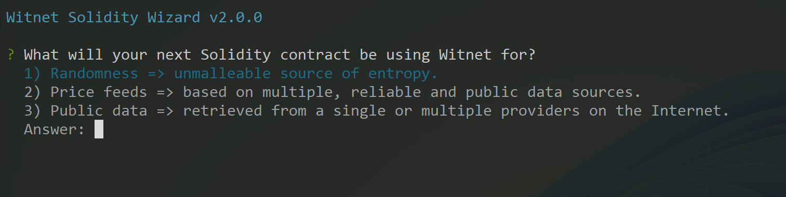

# Witnet Solidity 

Imports all package dependencies and tools required by any Solidity project willing to interact with the **[Witnet Oracle Blockchain]**. 

These are the most relevant features that make the **Witnet Oracle** stand out from other blockchain oracle solutions:

- **#1**: Data requests can be parametrically declared and verified from within smart contracts.
- **#2**: Any sort of data (JSON objects, primitive values or even binary buffers) can be pulled anytime from smart contracts.
- **#3**: Data traceability is possible: actual sources, offchain computations and sampling timestamps can be formally verified, as secured but the whole Witnet Oracle blockchain, in which witnessing nodes get randomly selected for every single data update. 
- **#4**: Data requests are paid with plain EVM currency.
- **#5**: No need to pre-fund smarts contracts with third-party ERC-20 tokens.
- **#6**: No need to undergo offchain subscription workflows.
- **#7**: No need to run your own Witnet nodes, nor any other kind of offchain infrastructure. 

Once you get this package installed and initialized, you will be able to:

- Build and test your own parameterized **Witnet Data Requests**.
- Check the EVM chains currently bridged to the Witnet Oracle Blockchain.
- Check the number of Witnet data sources, templates and requests that are already available within your project.
- Check the EVM addresses of all Witnet-based assets available on the specified chain.
- Deploy your own Witnet-based assets (sources, templates and requests) onto the specified chain. 
- Run a local ETH/RPC gateway and a Web3 console to ease both the deployment and the interaction or testing of your Witnet-based assets.
- Run the bundled **Witnet Solidity Wizard** to generate smart contracts skeletons adapted to your actual needs.
- Freely read from a selection of **Witnet Price Feeds** that get periodically updated by the Witnet Foundation, being able also to programmatically force a price update from within your smart contract, or even introspect the actual providers being used by the Witnet Foundation for every update. 
- Pull unmallable randomness from the Witnet Oracle Blockchain right into your smart contracts.

Last but not least, you will be able to interact with the [Witnet Oracle Blockchain] in two different ways:

- *Asynchronously*: where some contract posts a data request into the Witnet Oracle contract, and once the request is resolved, the same contract or others eventually read the result from the Witnet Oracle itself.

- *Synchronously*: where you get the data requesting smart contract called back as soon as the data request is resolved by the Witnet Oracle. 


## Install the package

Remember to initilize NPM if running from an empty folder:

- `$ npm init -y`

Import the **`witnet-solidity`** package into your project:

- `$ npm install --save-dev witnet-solidity`

And then initialize it by running this command:

- `$ npx witnet init`

Once intialization takes place, several files and directories will be added to your root folder:
- `.env_witnet`
- `witnet/assets/**`
- `witnet/addresses.json`
- `witnet/_hardhat.config.js`
- `witnet/_truffle.config.js`

These config file templates illustrate how to address Witnet assets and supported chains from your own Hardhat or Truffle scripts.

## Package scripts

### `$ npx witnet`
```console
    avail     => List available resources from Witnet.
    check     => Check that all Witnet assets are properly declared.
    console   => Run a Truffle console as to interact with Witnet deployed artifacts.
    deploy    => Deploy requests and templates as declared within the /witnet/assets folder.
    ethrpc    => Run a local ETH/RPC gateway to the specified chain.
    test      => Dry-run requests and templates as declared within the witnet/assets folder.
    wizard    => Helps you to integrate the Witnet Oracle within your smart contracts.
```

### `$ npx witnet avail`
```console
      --chains [<optional-list>]        => List supported sidechains and deployed Witnet artifact addresses within those.
      --requests [<optional-list>]      => Show details of all Witnet request artifacts currently available for deployment.
      --templates [<optional-list>]     => Show details of all Witnet template artifacts currently available for deployment.
      --sources [<optional-list>]       => Show details of Witnet data retriving scripts referable from other Witnet artifacts.
```

### `$ npx witnet check`

This script will perform a syntax check on the Witnet-based assets declared within the `witnet/assets` folder. Declaration of Witnet-based assets like data sources, aggregation filters or reducers, off-chain computation scripts (i.e. Witnet Radon scripts) and/or data requests (either static or parametrized) relies on the *Witnet Radon Typescript library* exported by the [`witnet-toolkit`](https://github.com/witnet/witnet-toolkit) package that gets installed together with `witnet-solidity`.

Right after initialization you should see:
```console
   WITNET ASSETS
   -------------
   > Data sources:      0
   > Data requests:     0
   > Request templates: 0

Sorry, there are no assets to check.
```
Add asset declartions to the resource files within the `witnet/assets` folder as to meet the requirements for retrieving real world data to your smart contracts. 

> *If getting an error during assets check, have a look into the stack trace to locate the asset resource file and line number.*

### `$ npx witnet test`
This script will simulate the deployment of the data requests and templates declared within your project, running also the tests that you may have optionally declared within the `witnet/assets` folder. These tests will dry-run the resolution of data requests exactly in the same way as they would be resolved by the Witnet Oracle blockchain. The tests will let you verify the correctness of the data sources being referred, and the actual data that they provide.

```console
Usage:

  $ npx witnet test <witnet-supported-chain> [--artifacts <comma-separated-artifacts-to-be-deployed> [--verbose]]
```
> *If no artifacts are specified, all Witnet assets declared within your project will be tested instead. If using the `--verbose` flag, your will see the details about every step that would be ultimately taken by the Witnet blockchain nodes involved in the resolution of the data requests being tested. Add the `--legacy` flag in case you want to testany of Witnet "legacy" assets that are bundled within this package out-of-the-box and listed by `npx witnet avail`.

### `$ npx witnet ethrpc`
This script runs an off-the-shelf ETH/ROC local gateway, as exported by the [web-jsonrpc-gateway](https://github.com/witnet/web3-jsonrpc-gateway) package. The local gateway being launched is pre-configured with all EVM chains currently bridged to the Witnet Oracle blockchain.
```console
Usage:

   $ npx witnet ethrpc [<ecosystem>[:<network>] [custom-rpc-provider-url]]

At least one of the following env variables must be previously set (or included within an .env file):

   W3GW_PRIVATE_KEYS    => An array of one or more private keys from which wallet addresses will be derived.
   W3GW_SEED_PHRASE     => Secret phrase from which wallet addresses will be derived.

Optionally, you can specify a custom endpoint by setting:

   W3GW_PROVIDER_URL    => The JSON ETH/RPC provider to connect to.
```

### `$ npx witnet deploy`
This command deploys the specified Witnet requests and/or templates into the specified chain:
```console
Usage:

  $ npx witnet deploy <witnet-supported-chain> --artifacts <comma-separated-artifacts-to-be-deployed>

To get a list of <witnet-supported-chain>:

  $ npx witnet avail --chains

No need to specify <witnet-supported-chain> if WITNET_SOLIDITY_DEFAULT_CHAIN environment variable is set, though.
However, if <witnet-supported-chain> is specified, that will always prevail upon the value of WITNET_SOLIDITY_DEFAULT_CHAIN.
```

> *Add the `--legacy` flag in case you want to deploy any of Witnet "legacy" assets that are bundled out-of-the-box within this package and listed by `npx witnet avail`. Deployable Witnet artifacts are unowned and counter-factual, so if anybody else had previously deployed any of these legacy assets on the specified chain, you would get just the same EVM address at a rather low cost*.

### `$ npx witnet console`
This script runs a Truffle console as to interact with your deployed Witnet-based assets in the specified chain:
```console
Usage:

  $ npx witnet console <witnet-supported-chain>

To get a list of <witnet-supported-chain>:

  $ npx witnet avail --chains

No need to specify <witnet-supported-chain> if WITNET_SOLIDITY_DEFAULT_CHAIN environment variable is set, though.
However, if <witnet-supported-chain> is specified, that will always prevail upon the value of WITNET_SOLIDITY_DEFAULT_CHAIN.
```

### `$ npx witnet wizard`
A CLI wizard will run asking some questions about what you want to integrate the Witnet Oracle for:



> *Every time the wizard is run, a new Solidity file will be added to your project's `./contracts` subfolder.*

## License

`witnet-solidity` is published under the [MIT license][license].

[license]: https://github.com/witnet/witnet-solidity/blob/master/LICENSE
[docs]: https://docs.witnet.io/smart-contracts/witnet-web-Oracle
[Witnet Oracle Blockchain]: https://witnet.io
